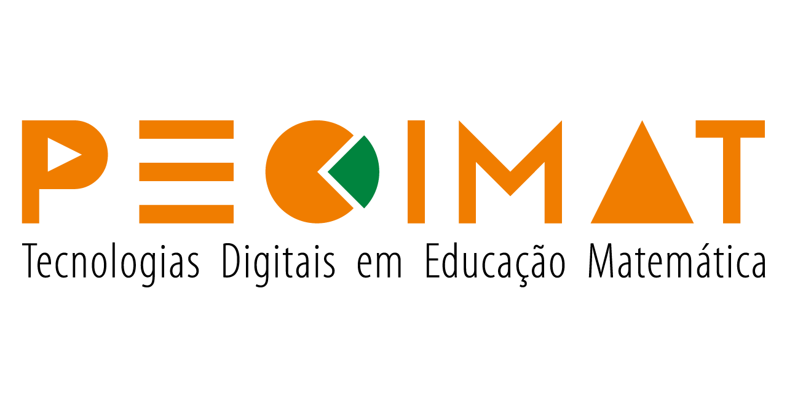
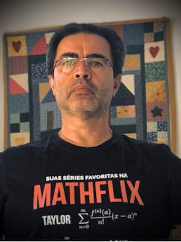
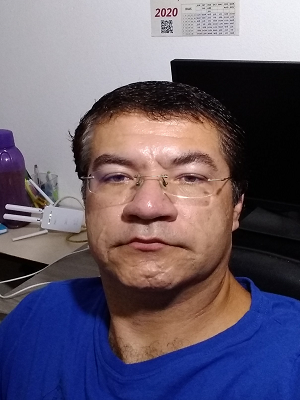
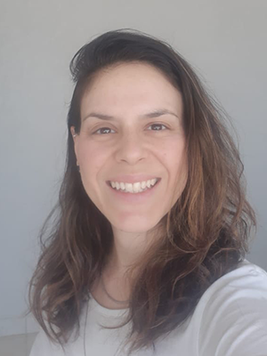
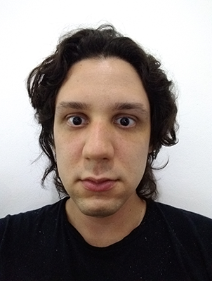
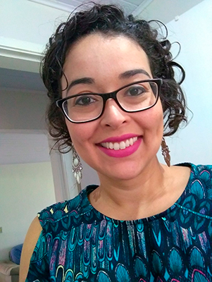
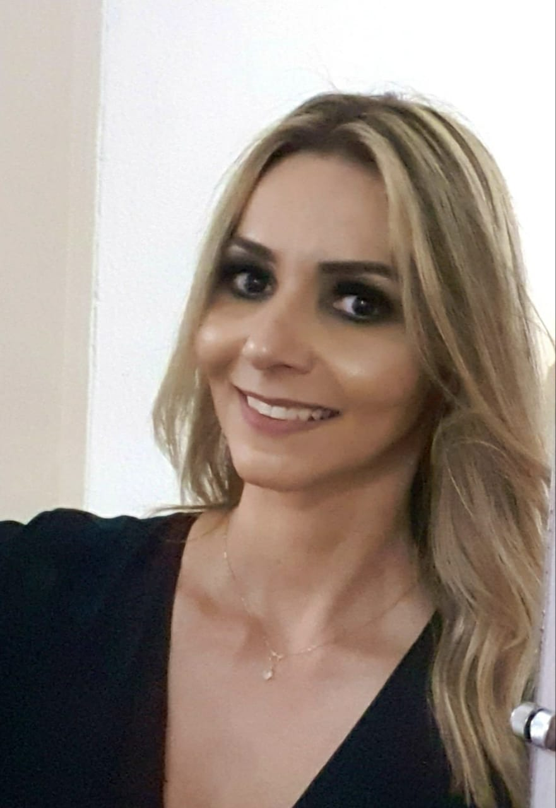

Este é o site do PECIMAT, o grupo de pesquisa
  - em ensino de Matemática com tecnologias e também 
  - em formação de professores que ensinam matemática

[Veja o registro de grupos no CNPq](http://dgp.cnpq.br/dgp/espelhogrupo/50534)

Formado em 2011 no PECIM, program interunidades de pós-graduação em 
ensino de ciências e matemática da Unicamp e com os **seguintes membros** em ordem _peculiar_:

## Prof. Dr. Samuel Rocha de Oliveira 
 

_Foto de Setembro/2020_ 

Bacharel (1983) e mestre (1986) em Física pela Universidade de Brasília e Ph.D.(1992) in Physics pela University of Texas at Austin. Professor Livre Docente da Universidade Estadual de Campinas no departamento de Matemática Aplicada desde 1996. Tem pesquisa em Física-Matemática principalmente nos seguintes temas: relatividade geral, gravitação, buracos negros, relatividade numérica, computação científica, astrofísica e equações diferenciais parciais.
Tem atuado também na área de Educação Matemática e de Divulgação Científica, principalmente nos seguintes temas: recursos didáticos digitais, objetos de aprendizagem, aprendizagem de matemática em multimídia digital, produção de programas de áudio e vídeo e tecnologias no ensino de matemática.
Veja o [CV Lattes]( http://lattes.cnpq.br/9839813543918575)

## Profa. Dra. Rúbia Barcelos Amaral-???????
Professora Livre-Docente do Departamento de Educação Matemática da UNESP - Rio Claro-SP e vinculada ao Programa de Pós-Graduação em Educação Matemática - PPGEM. Possui graduação em Licenciatura em Matemática pela UNESP - Universidade Estadual Paulista Júlio de Mesquita Filho (2000); Mestrado, Doutorado e Livre-Docência em Educação Matemática também pela UNESP (2002, 2007, 2017) e Pós-Doutorado na NCSU - North Carolina State University (2016). Trabalhou na Universidade Estadual de Campinas - UNICAMP e mantem-se professora colaboradora do Programa de Pós-Graduação Multiunidades em Ensino de Ciências e Matemática (PECIM). Lecionou também em instituições de ensino médio e superior e tem experiência na área de Educação Matemática, com ênfase em Tecnologia e Educação à Distância, atuando principalmente nos seguintes temas: Aprendizagem da Matemática, Tecnologia Informática e Formação de Professores. Publicou artigos em periódicos especializados e trabalhos em anais de eventos no Brasil e no exterior. Possui capítulos de livros publicados e produções técnicas. É autora do livro "Educação a distância online". Orienta pesquisas de Iniciação Científica, Mestrado e Doutorado. Atualmente é chefe do Departamento de Educação Matemática, Vice-coordenadora do curso de Matemática e Coordenadora do Pibid - Núcleo Rio Claro e São José do Rio Preto.
Veja o [CV Lattes](http://lattes.cnpq.br/5875288343819683)

## Prof. Dr. Valdinei Cardoso 
 

_Foto de Setembro/2020_

Doutor em Ensino de Ciências e Matemática pela Faculdade de Educação da Universidade Estadual de Campinas (2014). Mestre em Educação para a Ciência e o Ensino de Matemática pela Universidade Estadual de Maringá(2010). Especialista em Educação Matemática pela União das Escolas Superiores do Vale do Ivaí (2002). Graduado em Matemática pela Universidade Estadual de Maringá(2001), Professor Adjunto do Departamento de Matemática Aplicada do Centro Universitário Norte do Espírito Santo da Universidade Federal do Espírito Santo. Atua na área de pesquisa de Educação Matemática com ênfase na Modelagem Matemática na educação matemática, jogos digitais, modelos mentais, teoria dos campos conceituais, teoria cognitiva da aprendizagem multimídia, teoria das Representações Semióticas, vídeos digitais no ensino de matemática, educação à distância e novas tecnologias. É coordenador do Grupo de pesquisa Mídias e Matemática (MidMat) no Centro Universitário Norte do Espírito Santo(CEUNES) da Universidade Federal do Espírito Santo.
[CV Lattes](http://lattes.cnpq.br/3560165817659228)

### Doutoranda Marília Franceschinelli de Souza 
 

_Foto de Setembro/2020_

Professora de Matemática do Instituto Federal de São Paulo (IFSP), Câmpus Hortolândia, atuando na Educação Básica, Superior e Formação de Professores. Graduada em Matemática Aplicada e Computacional (2005) e em Licenciatura em Matemática pela Universidade Estadual de Campinas (2008) e Mestra em Matemática pelo Programa em rede nacional - PROFMAT (2014), realizado na Unicamp. 
Possui experiência na docência do Ensino Fundamental Anos Finais, Médio e superior, e em projetos interdisciplinares e de educação não-formal. Atualmente é doutoranda em Ensino de Matemática pelo PECIM - Programa de Pós-graduação em Ensino de Ciências e Matemática, UNICAMP, realizando pesquisa com formação de professores com tecnologias. É membro do Grupo de Pesquisa em Educação Matemática e Tecnologia (GPEMATEC-IFSP) e do Grupo de Pesquisa PECIMAT: Tecnologias Digitais em Educação Matemática (UNICAMP). É praticante e entusiasta de Ginástica pata todos (GPT).
Veja o [CV Lattes](http://lattes.cnpq.br/3428751536777364)

### Doutorando Marcos Henrique de Paula Dias da Silva

_Foto de Outubro/2020_

Graduado em Matemática pela USP (2009-2015), Mestre em Ensino de Ciências pela UNESP (2016-2018) na linha de pesquisa Informática em ensino de ciências e matemática, Doutorado em ensino de ciências pela UNICAMP (2019 -). Experiência em Teoria das Medidas, Jogos, Ensino de Matemática e Ciências, Pensamento Computacional, Ciência da Computação Desconectada, Ensino de Demonstração de Teoremas, Divulgação Científica de Matemática. Pesquisador do grupo ["Estudos da Educação Infantil e da Primeira Infância: Políticas e Programas" CNPQ - UNESP](http://dgp.cnpq.br/dgp/espelhogrupo/7191345846551508), membro do Grupo de Pesquisa ["PECIMAT: Tecnologias Digitais na Educação Matemática " CNPQ - UNICAMP](http://dgp.cnpq.br/dgp/espelhogrupo/5095321310667411) e do [Grupo de Pesquisa" Robótica Pedagógica CNPQ - UNICAMP](http://dgp.cnpq.br/dgp/espelhogrupo/5536226919069661). Editor do [Blog de Divulgação Científica ZERO](https://www.blogs.unicamp.br/zero/), com o tema Formalismo e Ludicidade, e vinculado à UNICAMP.

Veja o [CV Lattes]( http://lattes.cnpq.br/6130937835002478)

### Doutoranda Fabiana Santos Cotrim

_Foto de Janeiro/2020_

Bacharel (2008) e licenciada (2010) em Matemática pela UFSCar - São Carlos, mestre (2011) em Matemática pelo Programa de Pós Graduação em Matemática da UFSCar e atualmente, doutoranda em Ensino de Ciências e Matemática pelo Programa de Pós-Graduação Multiunidades em Ensino de Ciências e Matemática da UNICAMP na linha de formação de professores com foco no conhecimento do professor de matemática no ensino superior. É docente efetiva na UFSCar - campus Lagoa do Sino na área de matemática, alocada no Centro de Ciências da Natureza. Tem experiência em matemática na área de topologia algébrica, especificamente em Teoria de Nielsen, mas agora tem interesse em formação de professores e ensino de matemática.

Veja o [CV Lattes](http://lattes.cnpq.br/5304106217466160)

### Doutoranda Mariana 

_Foto de Dezembro/2019_

Doutoranda em Ensino de Ciências e Matemática pela Universidade Estadual de Campinas - Unicamp, Mestra em Educação em Ciências e Matemática pelo Instituto Federal do Espírito Santo - Ifes. Possui graduação em Licenciatura Plena em Matemática pela Universidade Federal do Espírito Santo/Ceunes (2005). Especialista em Ensino na Educação Básica, àrea de concentração Matemática pela Universidade Federal do Espírito Santo/Ceunes (2011). Tem experiência na área de Educação Matemática, atuando principalmente nos seguintes temas: Formação de Professores, Modelo dos Campos Semânticos, Educação Matemática Crítica, Empoderamento Docente. Membra do Grupo de pesquisa PeciMATIC e Gepemem. É professora do Instituto Federal do Espírito Santo - Campus Nova Venécia.

Veja o [CV Lattes](http://lattes.cnpq.br/6684778801921463)

